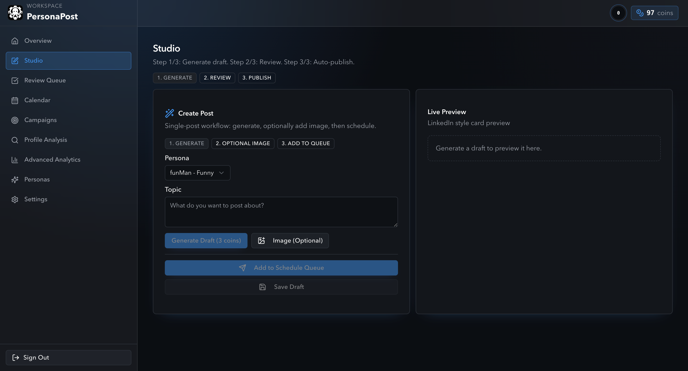

# PersonaPost

<p align="center">
  
</p>



PersonaPost is a LinkedIn-first content automation workspace built with Next.js + Convex. It helps you generate, review, schedule, and publish posts with an approval-first workflow.

## Highlights

- AI-powered post generation using `GROK_API_KEY`
- Approval-first review queue (no auto-publish without review)
- Weekly planning and campaign-oriented content generation
- Queue-aware scheduling and publishing reliability protections
- LinkedIn OAuth integration and profile analytics
- Cloudinary media support
- Razorpay-based coin flows

## Tech Stack

- Next.js 16 (App Router)
- React 19 + TypeScript
- Convex (database + backend functions)
- SWR
- Cloudinary
- LinkedIn OAuth
- Razorpay

## Project Structure

- `app/` - Next.js App Router pages and API routes
- `components/` - UI components
- `convex/` - Convex schema and functions
- `lib/` - integrations, auth, AI, utilities
- `public/` - static assets (logos, icons, screenshots)

## Local Development

1. Install dependencies:

```bash
npm install
```

2. Start Convex + Next.js:

```bash
npm run dev
```

3. Open:

- App: [http://localhost:3000](http://localhost:3000)

## Environment Variables

Copy `.env.example` to `.env.local` and fill values.

### Required

- `NEXT_PUBLIC_CONVEX_URL`
- `CONVEX_ADMIN_KEY`
- `SESSION_SECRET` (required in production)
- `GROK_API_KEY`

### Recommended / In Use

- `CONVEX_DEPLOYMENT`
- `NEXT_PUBLIC_CONVEX_SITE_URL`
- `NEXT_PUBLIC_APP_URL`
- `GROK_MODEL`
- `RAZORPAY_KEY_ID`
- `RAZORPAY_KEY_SECRET`
- `NEXT_PUBLIC_CLOUDINARY_CLOUD_NAME`
- `CLOUDINARY_API_KEY`
- `CLOUDINARY_API_SECRET`
- `LINKEDIN_CLIENT_ID`
- `LINKEDIN_CLIENT_SECRET`
- `LINKEDIN_REDIRECT_URI`
- `LINKEDIN_REQUEST_OFFLINE_ACCESS`

## Reliability Rules

- Posts are never published without user approval
- Scheduled queue order determines publishing priority
- Retry/backoff and dead-letter protections are built into publishing flow
- Disconnected channel constraints are surfaced in scheduling/publishing flows

## Useful Scripts

- `npm run dev` - run Next.js + Convex concurrently
- `npm run lint` - lint codebase
- `npm run build` - production build
- `npm run convex:dev` - run Convex dev server
- `npm run convex:deploy` - deploy Convex functions

## Production Checklist

Run before deploy:

```bash
npm run lint
npm run build
```

Minimum production env:

- `SESSION_SECRET`
- `NEXT_PUBLIC_CONVEX_URL`
- `CONVEX_ADMIN_KEY`
- `GROK_API_KEY`
- LinkedIn keys for LinkedIn features
- Cloudinary and Razorpay keys for those feature paths
