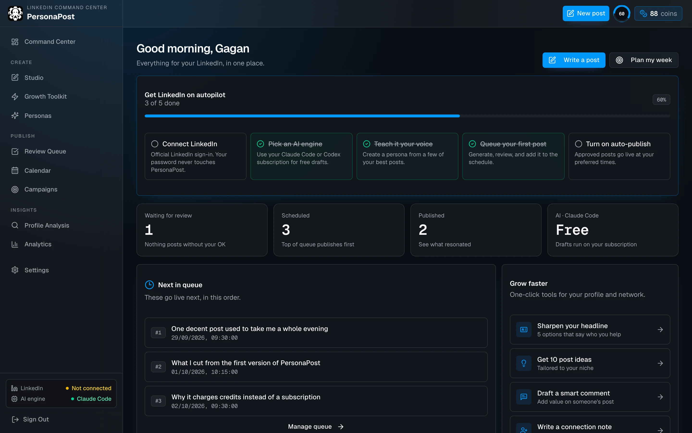

# PersonaPost



PersonaPost reworks your whole LinkedIn from one place: headline, About, posts, comments and connection notes, plus what worked. It writes in your voice, leaves a `[bracketed gap]` instead of inventing facts, and never publishes a post you haven't approved.

## Highlights

- **Studio**: posts drafted from rough notes in your persona's voice; plan a whole week at once
- **Growth Toolkit**: headline, About, post ideas, hooks, comments and connection notes
- **Review queue + calendar**: approval-first, drag to reorder, auto-publish at your times
- **Profile analysis**: likes, comments, reposts, best day and hour from LinkedIn
- **Bring your own AI**: run drafts on your Claude Code or Codex subscription (see below)
- LinkedIn via official OAuth only (no passwords, no scraping, no auto-engagement)
- Cloudinary images, Razorpay credit packs

## AI engines

Pick one per account under **Settings → AI Engine**, with a **Test connection** button.

| Engine | Needs | Credits |
|---|---|---|
| Claude Code | `claude` CLI installed and logged in on the server machine | free |
| Codex | `codex` CLI installed and `codex login` on the server machine | free |
| Groq API | `GROK_API_KEY` | charged |

Local engines are spawned with every tool disabled (`claude -p --tools ""`, `codex exec -s read-only`), and `ANTHROPIC_API_KEY` / `OPENAI_API_KEY` are stripped from their environment so they bill your subscription, not an API key. They only work when PersonaPost runs on your own machine, and each person should use their own login: don't expose your personal subscription to other users of a hosted instance.

## Connecting LinkedIn

"Sign in with LinkedIn" uses LinkedIn's OAuth: you log in on LinkedIn's page and PersonaPost gets a revocable token (`w_member_social`, profile, email). PersonaPost never asks for or stores a LinkedIn password; password-based automation violates LinkedIn's User Agreement and gets accounts restricted. LinkedIn's API doesn't allow apps to edit your headline or About, so the Toolkit gives you options to paste.

## Tech Stack

- Next.js 16 (App Router)
- React 19 + TypeScript
- Convex (database + backend functions)
- SWR
- Cloudinary
- LinkedIn OAuth
- Razorpay

## Project Structure

- `app/` - Next.js App Router pages and API routes
- `components/` - UI components
- `convex/` - Convex schema and functions
- `lib/` - integrations, auth, AI, utilities
- `public/` - static assets (logos, icons, screenshots)

## Local Development

1. Install dependencies:

```bash
npm install
```

2. Start Convex + Next.js:

```bash
npm run dev
```

3. Open:

- App: [http://localhost:3000](http://localhost:3000)

## Environment Variables

Copy `.env.example` to `.env.local` and fill values.

### Required

- `NEXT_PUBLIC_CONVEX_URL`
- `CONVEX_ADMIN_KEY`
- `SESSION_SECRET` (required in production)
- An AI engine: the `claude` or `codex` CLI on the server machine, or `GROK_API_KEY`
- `NEXT_PUBLIC_APP_URL` in production, so LinkedIn/Slack link previews get absolute image URLs

### Recommended / In Use

- `CONVEX_DEPLOYMENT`
- `NEXT_PUBLIC_CONVEX_SITE_URL`
- `NEXT_PUBLIC_APP_URL`
- `GROK_MODEL`
- `RAZORPAY_KEY_ID`
- `RAZORPAY_KEY_SECRET`
- `NEXT_PUBLIC_CLOUDINARY_CLOUD_NAME`
- `CLOUDINARY_API_KEY`
- `CLOUDINARY_API_SECRET`
- `LINKEDIN_CLIENT_ID`
- `LINKEDIN_CLIENT_SECRET`
- `LINKEDIN_REDIRECT_URI`
- `LINKEDIN_REQUEST_OFFLINE_ACCESS`

## Reliability Rules

- Posts are never published without user approval
- Scheduled queue order determines publishing priority
- Retry/backoff and dead-letter protections are built into publishing flow
- Disconnected channel constraints are surfaced in scheduling/publishing flows

## Useful Scripts

- `npm run dev` - run Next.js + Convex concurrently
- `npm run lint` - lint codebase
- `npm run build` - production build
- `npm run convex:dev` - run Convex dev server
- `npm run convex:deploy` - deploy Convex functions

## Production Checklist

All Convex functions are internal, so the app must have `CONVEX_ADMIN_KEY` set to a deploy key for the same deployment (Convex dashboard, Settings, Deploy keys). Check it's in Vercel before running `npx convex deploy`; without it the app can't read or write data once the functions are deployed.

Run before deploy:

```bash
npm run lint
npm run build
```

Minimum production env:

- `SESSION_SECRET`
- `NEXT_PUBLIC_CONVEX_URL`
- `CONVEX_ADMIN_KEY`
- `GROK_API_KEY` (hosted deploys have no local CLI)
- LinkedIn keys for LinkedIn features
- Cloudinary and Razorpay keys for those feature paths
